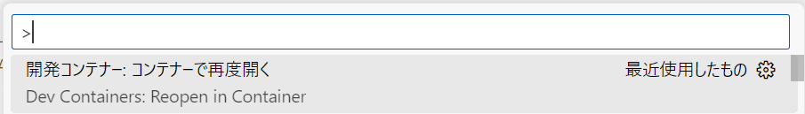

# AWS Lambda(Python)の開発環境

## 概要

以下のソフトウェアで構成された AWS Lambda(Python) の開発環境。
サーバレスアプリケーションフレームワークをローカル環境で開発できるようにした開発環境を、Dev Containerでパッケージングしている。

- [Dev Container](https://code.visualstudio.com/docs/devcontainers/containers)
- [AWS Chalice](https://aws.github.io/chalice/)
- [LocalStack](https://docs.localstack.cloud/overview/)

## 構成

### Visual Studio Codeの拡張機能

|カテゴリ|拡張機能名|説明|
|:----|:----|:----|
|Python|[Python](https://marketplace.visualstudio.com/items?itemName=ms-python.python)|Python拡張機能|
| |[Pylance](https://marketplace.visualstudio.com/items?itemName=ms-python.vscode-pylance)|静的解析ツール|
| |[Python Debugger](https://marketplace.visualstudio.com/items?itemName=ms-python.debugpy)|デバッガ|
| |[Ruff](https://marketplace.visualstudio.com/items?itemName=charliermarsh.ruff)|リンター＆コードフォーマッタ|
| |[autoDocstring](https://marketplace.visualstudio.com/items?itemName=njpwerner.autodocstring)|コメントテンプレート生成|
|開発支援ツール|[IntelliCode](https://marketplace.visualstudio.com/items?itemName=VisualStudioExptTeam.vscodeintellicode)|AI支援|
| |[IntelliCode API Usage Examples](https://marketplace.visualstudio.com/items?itemName=VisualStudioExptTeam.intellicode-api-usage-examples)|AI支援（APIの使用例表示）|
| |[IntelliCode Completions](https://marketplace.visualstudio.com/items?itemName=VisualStudioExptTeam.vscodeintellicode-completions)|AI支援（コード補完）|
| |[Code Spell Checker](https://marketplace.visualstudio.com/items?itemName=streetsidesoftware.code-spell-checker)|スペルチェッカー|
| |[YAML](https://marketplace.visualstudio.com/items?itemName=redhat.vscode-yaml)|リンター＆コードフォーマッタ|
| |[VS Code Counter](https://marketplace.visualstudio.com/items?itemName=uctakeoff.vscode-counter)|ステップカウンター|
| |[Bookmarks](https://marketplace.visualstudio.com/items?itemName=alefragnani.Bookmarks)|ブックマーク|
| |[Error Lens](https://marketplace.visualstudio.com/items?itemName=usernamehw.errorlens)|エラーメッセージのインライン表示|
| |[Material Icon Theme](https://marketplace.visualstudio.com/items?itemName=PKief.material-icon-theme)|アイコン|
|AWS|[AWS Toolkit](https://marketplace.visualstudio.com/items?itemName=AmazonWebServices.aws-toolkit-vscode)|AWS操作|
|Markdown|[Markdown Preview Enhanced](https://marketplace.visualstudio.com/items?itemName=shd101wyy.markdown-preview-enhanced)|Markdown プレビュー|
| |[markdownlint](https://marketplace.visualstudio.com/items?itemName=DavidAnson.vscode-markdownlint)|リンター|
| |[Markdown Table](https://marketplace.visualstudio.com/items?itemName=TakumiI.markdowntable)|Markdown のテーブル作成支援|
| |[Paste Image](https://marketplace.visualstudio.com/items?itemName=mushan.vscode-paste-image)|画像の貼り付け|
|ドキュメント|[Draw.io Integration](https://marketplace.visualstudio.com/items?itemName=hediet.vscode-drawio)|作図ツール|
| |[OpenAPI (Swagger) Editor](https://marketplace.visualstudio.com/items?itemName=42Crunch.vscode-openapi)|OpenAPIエディタ|
|テスト|[REST Client](https://marketplace.visualstudio.com/items?itemName=humao.rest-client)|HTTPリクエストツール|

### Pythonパッケージ

|パッケージ名|説明|
|:----|:----|
|[uv](https://pypi.org/project/uv/)|パッケージ管理ツール|
|[boto3](https://pypi.org/project/boto3/)|AWS SDK|
|[marshmallow](https://pypi.org/project/marshmallow/)|スキーマバリデーションライブラリ|
|[pg8000](https://pypi.org/project/pg8000/)|PostgreSQL接続ライブラリ|
|[pytest](https://pypi.org/project/pytest/)|テストフレームワーク|
|[pytest-cov](https://pypi.org/project/pytest-cov/)|テストカバレッジ|
|[pytest-mock](https://pypi.org/project/pytest-mock/)|モック|
|[chalice](https://pypi.org/project/chalice/)|サーバレスアプリケーションフレームワーク|
|[chalice-local](https://pypi.org/project/chalice-local/)| AWS Chaliceクライアント|

## 構築

### Windows

1. 以下のアプリケーションをインストールし、起動する  

    ```cmd
    winget install -e --id suse.RancherDesktop
    winget install -e --id Microsoft.VisualStudioCode 
    ```

2. Visual Studio Codeに以下の拡張機能をインストールする  

    [Remote Development](https://marketplace.visualstudio.com/items?itemName=ms-vscode-remote.vscode-remote-extensionpack)

3. Visual Studio Codeに本リポジトリを「フォルダを開く」で追加する  
    [ファイル(F)]-[フォルダを開く...]

4. 以下が表示されるので「コンテナーを再度開く」を選択する  

    </br>
    もしくは Ctrl+Shift+P で「Dev Containers: ReOpen in Container」を実行する  
      

## 実行

### ローカル環境

- デプロイ

    ```cmd
    AWS_ENDPOINT_URL=http://localstack:4566 chalice-local deploy
    ```

### AWS環境

- 事前準備
    1. 以下に従い、AWS CLI をセットアップする
        <https://docs.aws.amazon.com/ja_jp/cli/latest/userguide/getting-started-quickstart.html>

- デプロイ

    ```cmd
    chalice deploy
    ```

- デプロイ削除

    ```cmd
    chalice delete
    ```
